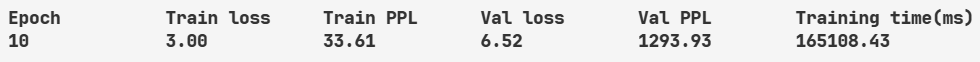
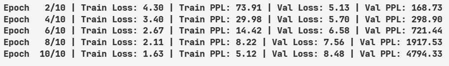
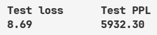
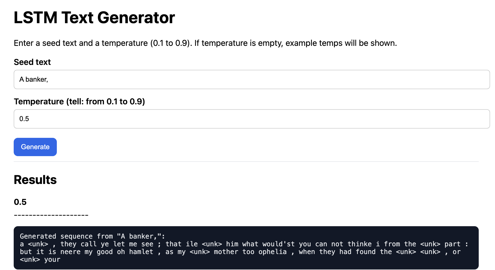

# LSTM Language Model (Flask demo)
A small LSTM-based language model project with a lightweight Flask UI to generate text from a seed phrase.  
This repository contains training scripts, saved checkpoints and a demo Flask app to interactively generate text at different temperatures.

## Experiment Results
### Traning Loss and Perplexity Loss


### Average Traning Loss and Perplexity Loss


### Inference Loss and Perplexity Loss


## Note on Results
From the training screenshots we can see that:

-Training loss decreases over epochs (example: train loss ↓ from ~4.30 to ~1.63).

-Train perplexity (PPL) drops correspondingly (e.g., ~73.9 → ~5.1).

-Validation loss and perplexity increase significantly across epochs (val loss and val PPL jump to very large values).

-Test loss and test PPL are also high (e.g. test loss 8.69, test PPL 5932.30), indicating poor generalization.

Conclusion: The model is likely overfitting the training data. Training loss improves, but validation/test metrics worsen.

**More experiment and fine -tuning need to improve model generalization.**

## Project structure 

```

.
├── app/
│   ├── app.py             
│   ├── LSTM.py             
│   ├── saved_model/       
│   │   └── checkpoint.pt
│   └── **pycache**/
├── model.ipynb
├── README.md
└── requirements.txt

````


## How to Run the Flask App

1. **Open the terminal / command prompt**

2. **Navigate to the folder where `app.py` is located**

```bash
cd path/to/your/project/app
```

(Replace `path/to/your/project/app` with the actual folder path.)

3. **Run the Flask application**

```bash
python app.py
```

4. **Wait for the server to start**

You should see a message similar to:

```
Running on http://127.0.0.1:5000
```

5. **Open the app in your web browser**

Go to:

```
http://127.0.0.1:5000/
```

Now you can use the Flask web interface to generate text 🎉

## Example usage (from the UI)

